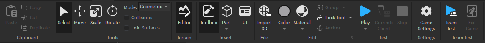

[Roblox Studio](https://ru.wikipedia.org/wiki/Roblox_Studio) — кроссплатформенный движок для создания, публикации, модерации и администрирования собственных игр  на платформе Roblox. 
- Основным языком разработки является язык [Luau](Lua/Lua.md "Улучшенный под цели Roblox язык Lua (В части написания кода ничем не отличается)")
- Есть встроенный AI-ассистент / [Toolbox](Toolbox.md "Встроенный маркетплейс с бесплатными ассетами") 
- Бесплатный хост серверов для режима

 

 <h1> Разделы</h1>

 

<h2 style="text-align: center" id="Home">Home</h2>

Здесь находятся базовые, чаще всего использующиеся инструменты и настройки.

- Paste / Copy / Cut / Duplicate — вставляют, копируют, вырезают или дублируют что-либо
- Select / Move / Scale / Rotate / Transform  — выбор (Позволяет также таскать объект при зажатии); перемещение, масштабирование по осям или свободно; вращение только по осям; а также полное трансформирование объекта.
- Mode — имеет две настройки: Geometric и Physics, в первом мы взаимодействуем с цельным объектом, даже если он состоит из нескольких других объектов, а во втором случае мы взаимодействуем с отдельным элементом полной модели.